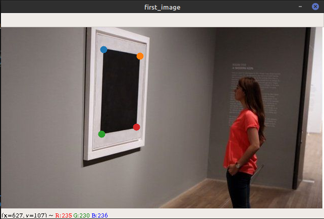
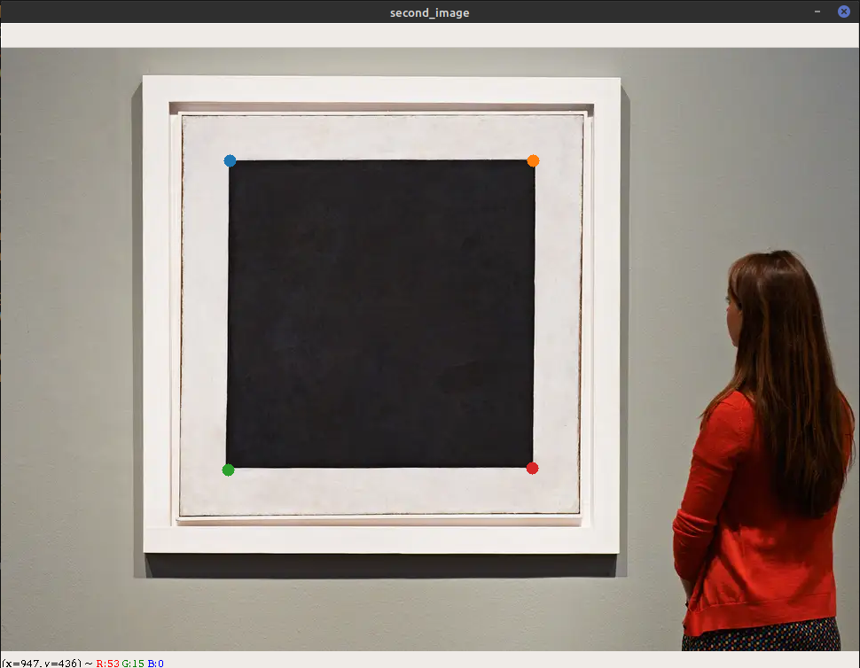
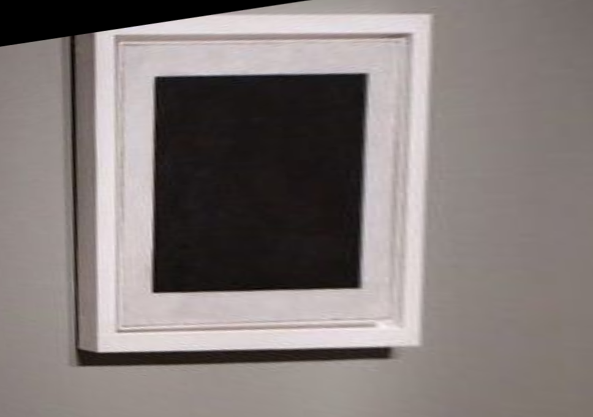

# OpenCV findHomography client

The aim of this project is to provide simple interface to cv2.findHomography where you can select key points and transform the first image to the second. Also homography matrix is saved.

## Getting Started

To use this project you should recreate conda environment which is saved in sv1.yml.

### Prerequisites

To install the environment:

```
conda env create -f sv1.yml
```

## Run run.py

To test this script use command:
```
python run.py bs1.jpg bs2.jpg
```

Select key points using left mouse button:


Then select the same key points on the second image:


## Enjoy results

Watch output folder. There should be warped first image:

and homography matrix saved in numpy format.

## That's it

There are 9 different colors (from matplotlib's tab10 palette) to select key points. But you can select as many points as you want. Then, the arrays of key points are shortened to smallest size.
